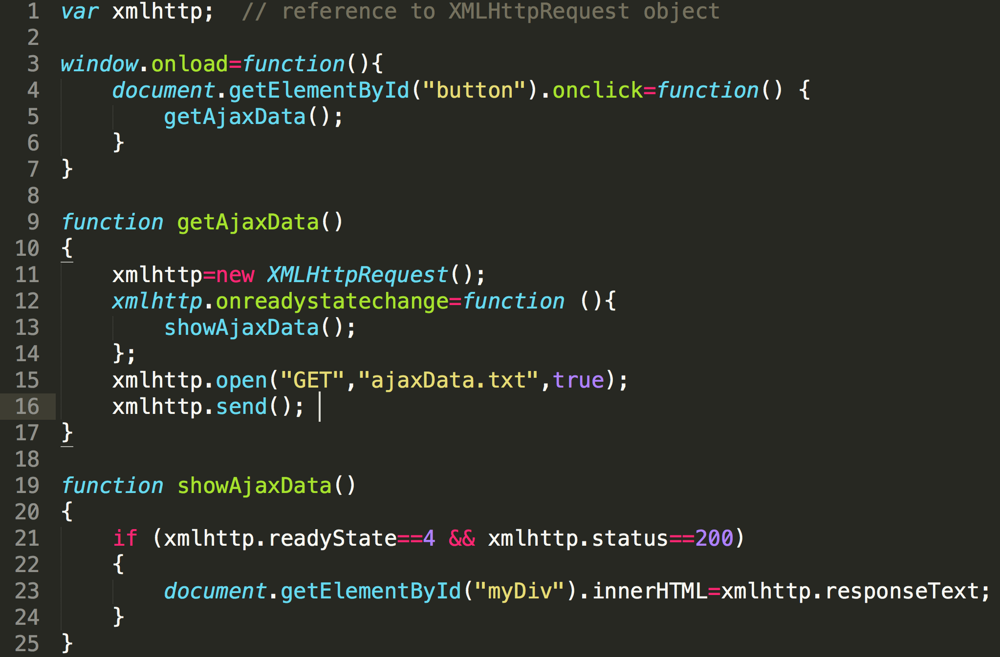
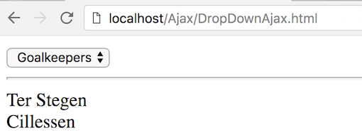

# Ajax Exercise 1 – Hello Ajax
		
> Note:: Complete ALL the exercises in this section.  If you need help email thomas.devine@lyit.ie

## Clone the Remote Repository

1.	Copy the clone URL from your new repository [ajax](https://github.com/noucampdotorgCSS2020/ajax.git)

1.	Type these commands into your *Git Bash* client:

	```
	$ cd /<DRIVE>/xampp/htdocs   
	$ git clone https://github.com/noucampdotorgCSS2020/ajax.git ajax
	$ cd ajax
	$ ls or dir
	$ git status

	```

Check your ``htdocs`` folder.  You should have a new folder called ``ajax`` with some files in it.


## Part 1 – Hello Ajax

1.	Using your code editor examine the HTML file called ``HelloAjax.html`` in your ``Ajax`` folder.  Notice it has a companion JavaScript file called ``HelloAjax.js``.

1.	Open the file ``HelloAjax.js`` and add the code below to it:

	

	This code will wait until you press the button and then perform the Ajax request.

1.	Lastly, look at the contents of the file ``ajaxData.txt``.  This is the data you will request using Ajax from the web server.

1.	Run the code by opening the HTML file [http://localhost/Ajax/HelloAjax.html](http://localhost/Ajax/HelloAjax.html).  You should see *hello, world!* when you click the button.


## Part 2 – Ajax Players

1.	Examine and then view the code in [http://localhost/Ajax/DropDownAjax.html](http://localhost/Ajax/DropDownAjax.html) that displays a dropdown box of player positions - goalkeepers, defenders, midfielders, and forwards.

	

	When a player position is selected retrieve the appropriate data for the player position from either of the corresponding files – ``goalkeepers.txt``, ``defenders.txt``, ``midfielders.txt`` and ``forwards.txt`` – and display that data on the HTML page.

	Modify the code in ``DropDownAjax.js`` to implement this functionality.


## Part 3 – Ajax PHP Requests

1.	Examine and then run the code in [http://localhost/Ajax/HelloAjaxAndPHP.html](http://localhost/Ajax/HelloAjaxAndPHP.html) that displays data retrieve from an Ajax request to a PHP program.

1.	Examine and then run the code in [http://localhost/Ajax/AjaxTimesTable.html](http://localhost/Ajax/AjaxTimesTable.html) that displays multiplication tables using Ajax requests to a PHP program.

	Pay particular attention to the code in ``AjaxTimesTable.js``.

