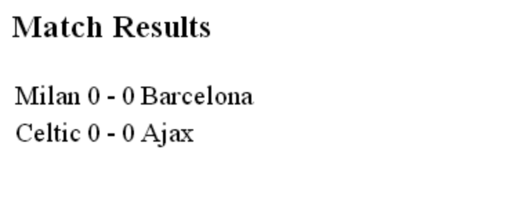

# Ajax Exercise 2 – Ajax JSON
		
> Complete ALL the exercises in this section.

<!-- ## Fetch latest Repository Branch

```
$ cd /DRIVE/xampp/htdocs/Ajax
$ git pull --no-edit https://github.com/noucampdotorgCSS2019/Ajax.git latest
$ git status

``` -->

Check your ``htdocs/JavaScript`` folder.  You should have some new files in it.

## Part 1

1.	Using your editor examine and understand the code in the files ``clubs.json``, ``clubsAjaxJSON.html`` and ``clubsAjaxJSON.js``.

1.	Run the code in [http://localhost/Ajax/clubsAjaxJSON.html](http://localhost/Ajax/clubsAjaxJSON.html) to see Ajax in action with JSON data.

1.	Modify the code in ``clubsAjaxJSON.js`` so each club's ground is shown in brackets after the club name, i.e.

	```
	Chelsea (Stamford Bridge)
	Liverpool (Anfield)
	Manchester Utd (Old Trafford)
	Arsenal (Emirates Stadium)

	```

1.	Modify the code in ``matchAjaxJSON.html`` and ``matchAjaxJSON.js`` that uses the JSON file ``matches.json`` to display this:

	

1.	Modify the code so that the scores are retrieved from the JSON file every 5 seconds. If a change is made to the scores in the JSON file it should be automatically updated in the HTML page.

<!-- 1.	Push your code to **your private** repository on GitHub.  Type these commands into your *Git Bash* client:

	```
	$ git status
	$ git add .
	$ git commit -m "Exercise 2 - Part 1 DONE|PARTIAL|HELP"
	$ git push origin master
	$ git status

	``` -->