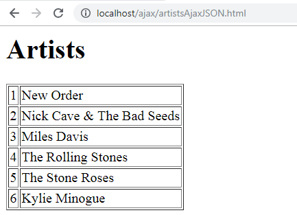

# Ajax Exercise 3 – Ajax JSON via PHP Database
		
> Complete ALL the exercises in this section.

<!-- ## Fetch latest Repository Branch

```
$ cd /DRIVE/xampp/htdocs/Ajax
$ git pull --no-edit https://github.com/noucampdotorgCSS2019/Ajax.git latest
$ git status

```

Check your ``htdocs/JavaScript`` folder.  You should have some new files in it. -->

## Part 1 - Clubs 

1.  Create the database `footballdb` using these SQL commands.  You should use [PHPMyAdmin](http://localhost/phpmyadmin/index.php).

    ```sql
    CREATE DATABASE footballdb;
    USE footballdb;

    CREATE TABLE `clubs` (
    `name` varchar(20),
    `ground` varchar(20)
    );

    INSERT INTO `clubs` VALUES
    ('Arsenal', 'Emirates Stadium'),
    ('Chelsea', 'Stamford Bridge'),
    ('Liverpool', 'Anfield'),
    ('Man Utd', 'Old Trafford');
    ```

1.  Run the PHP program [http://localhost/Ajax/getClubs.php](http://localhost/Ajax/getClubs.php)

    You should see this JSON data:

    ```
    {
        "clubs": 
        [
             {"name":"Arsenal","ground":"Emirates Stadium"},
             {"name":"Chelsea","ground":"Stamford Bridge"},
             {"name":"Liverpool","ground":"Anfield"},
             {"name":"Man Utd","ground":"Old Trafford"}
        ]
    }
    ```

1.  Use your editor to examine and understand the code in `getClubs.php`.

1.  View the HTML file [http://localhost/ajax/clubsAjaxJSONv2.html](http://localhost/ajax/clubsAjaxJSONv2.html) that makes the Ajax request to `getClubs.php` and renders the result in a HTML table.

1.  Again examine and understand this code.  It is important.


## Part 2 - Artists

Using the code above as a guide write code to retrieve artists from the `music` database and print the following:



Create:
- a HTML file `artistsAjaxJSON.html`
- a JS file `artistsAjaxJSON.js`
- a PHP file `getArtists.php`


## Part 3 - Artist Albums

1.  Run the PHP program [http://localhost/Ajax/getAlbums.php?artist_id=3](http://localhost/Ajax/getAlbums.php?artist_id=3)

    You should see album data for Miles Davis.  Do you know why?

    Use your editor to examine and understand the code in `getAlbums.php`.  In particular lines 2 & 6 are significant.

    Modify the URL above to see albums from other artists.

1.  View the HTML file [http://localhost/ajax/albumsAjaxJSON.html](http://localhost/ajax/albumsAjaxJSON.html) that makes the Ajax request to `getAlbums.php` and renders the result in a HTML table.

1.  Again examine and understand this code.


